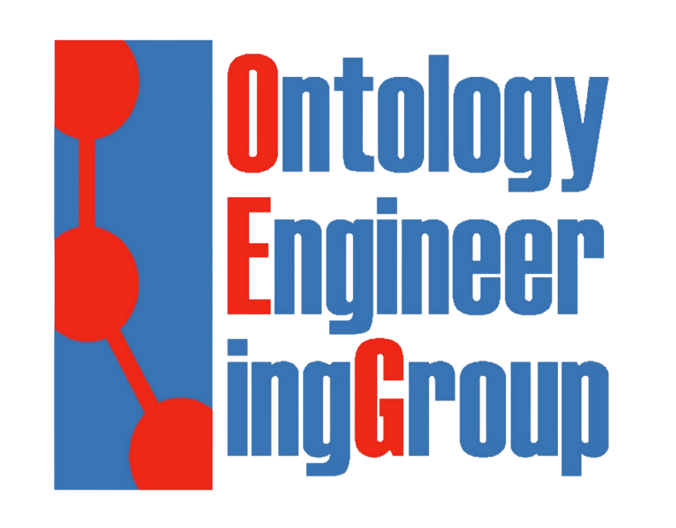

# RML

This page is an **introduction to [RML](https://w3id.org/rml/core/spec)**, the mapping language Morph-KGC reads. It starts from nothing and builds up, so you can follow it top to bottom on your first day with RML. Every mapping on this page is complete and runnable, and every result shown is the output Morph-KGC actually produces for it.

If you are looking for how to **configure and run the engine** instead, see the **[Documentation](https://morph-kgc.readthedocs.io/en/latest/documentation/)**. If you want the normative definition of the language, see the **[RML-Core specification](https://w3id.org/rml/core/spec)**.

## Concepts

An RML mapping says how to turn **records** of an input data source into **[RDF](https://www.w3.org/TR/rdf11-concepts/) triples**. A triple is three terms, always in the same order:

```
subject    predicate    object
```

It reads as a small sentence: *this thing* — *has this property* — *with this value*. A knowledge graph is a set of such sentences. Subjects and predicates are **IRIs** (identifiers); objects are either IRIs or **literals** (strings, numbers, dates).

A mapping is built from three nested pieces:

| Piece | What it does |
|---|---|
| **Logical source** | Names the data to read, and how to read it: a CSV file, a database table, a JSON document. |
| **Triples map** | Turns **one record** of that source into **one or more triples**. A mapping has as many triples maps as it needs. |
| **Term map** | Produces **one term** of a triple from the record: a subject, a predicate, an object, a graph. |

The engine reads the source record by record, and for each record it evaluates the term maps of each triples map and writes out the triples they form. Nothing is ordered, nothing is procedural: a mapping is a **declaration** of what the triples are, not a script that builds them.

RML is written in **[Turtle](https://www.w3.org/TR/turtle/)**, which is itself an RDF syntax. So a mapping is RDF that describes how to make RDF. That sounds circular but it is convenient in practice: mappings can be queried, validated and generated with the same tools as the data.

### The running example

Every example below maps this small film catalogue. Save the two files and you can run everything on this page.

`films.csv`:

``` csv
id,title,year,rating,director
1,Metropolis,1927,8.3,1
2,M,1931,8.3,1
3,Rashomon,1950,8.2,2
```

`directors.csv`:

``` csv
id,name,country
1,Fritz Lang,Austria
2,Akira Kurosawa,Japan
```

## Your First Mapping

Here is a complete mapping. It reads `films.csv` and gives every film a title.

``` turtle
@prefix rml: <http://w3id.org/rml/> .
@prefix ex:  <http://example.com/> .

<#FilmMapping> a rml:TriplesMap ;
    rml:logicalSource [
        rml:source "films.csv" ;
        rml:referenceFormulation rml:CSV
    ] ;
    rml:subjectMap [
        rml:template "http://example.com/film/{id}"
    ] ;
    rml:predicateObjectMap [
        rml:predicate ex:title ;
        rml:objectMap [ rml:reference "title" ]
    ] .
```

Read it from the inside out:

- The **logical source** is the file `films.csv`, read as CSV. Each row is one record.
- The **subject map** builds the subject from a **template**. `{id}` is replaced with the value of the `id` column, so row 1 gives `http://example.com/film/1`.
- The **predicate-object map** pairs a fixed predicate, `ex:title`, with an object taken from the `title` column.

Save it as `mapping.ttl`, put it next to `films.csv`, and run it with a configuration file that names the mapping:

``` ini
[FilmSource]
mappings: mapping.ttl
```

``` bash
morph-kgc config.ini
```

The result, in [N-Triples](https://www.w3.org/TR/n-triples/):

``` ntriples
<http://example.com/film/1> <http://example.com/title> "Metropolis" .
<http://example.com/film/2> <http://example.com/title> "M" .
<http://example.com/film/3> <http://example.com/title> "Rashomon" .
```

Three rows in, three triples out. Everything that follows is a variation on this.

## Term Maps

A term map is the unit that produces one term. There are four kinds, and they are the whole vocabulary you need for subjects, predicates, objects and graphs alike.

| Term map | Produces | Example |
|---|---|---|
| **`rml:constant`** | The same term for every record. | `rml:constant ex:Film` |
| **`rml:reference`** | The value of one column, field or element. | `rml:reference "title"` |
| **`rml:template`** | A string with `{...}` placeholders filled from the record. | `rml:template "http://example.com/film/{id}"` |
| **`rml:functionExecution`** | The result of a [transformation function](https://morph-kgc.readthedocs.io/en/latest/rml/#transformation-functions). | `rml:functionExecution <#Upper>` |

A record that has **no value** for a reference the term map needs produces **no term**, and therefore no triple. This is how NULL and missing fields are handled: they are skipped, not turned into empty strings. Which values count as missing is set with `na_values` in the **[engine configuration](https://morph-kgc.readthedocs.io/en/latest/documentation/#engine-configuration)**.

## Subjects

The subject map says what each record is *about*. In practice it is almost always a template, because the point is to mint one stable identifier per record.

``` turtle
rml:subjectMap [
    rml:template "http://example.com/film/{id}" ;
    rml:class ex:Film
]
```

`rml:class` is a shorthand for the `rdf:type` triple everybody writes anyway. The mapping above produces, for each film, both its own triples and:

``` ntriples
<http://example.com/film/1> <http://www.w3.org/1999/02/22-rdf-syntax-ns#type> <http://example.com/Film> .
```

A subject is an IRI by default. When a record describes something that needs no global identifier — an event, a measurement, an address — use a **blank node** instead:

``` turtle
rml:subjectMap [
    rml:template "screening{id}" ;
    rml:termType rml:BlankNode
]
```

``` ntriples
_:screening1 <http://example.com/of> <http://example.com/film/1> .
_:screening2 <http://example.com/of> <http://example.com/film/2> .
_:screening3 <http://example.com/of> <http://example.com/film/3> .
```

{==

*__Note:__ values interpolated into a template are **percent-encoded**, so a title containing a space or a slash still yields a valid IRI. Set `safe_percent_encoding` in the [engine configuration](https://morph-kgc.readthedocs.io/en/latest/documentation/#engine-configuration) to exempt characters you want to keep literal.*

==}

## Predicates and Objects

A triples map may carry any number of predicate-object maps, and each one contributes its own triples for every record.

``` turtle
@prefix rml:  <http://w3id.org/rml/> .
@prefix ex:   <http://example.com/> .
@prefix xsd:  <http://www.w3.org/2001/XMLSchema#> .
@prefix rdfs: <http://www.w3.org/2000/01/rdf-schema#> .

<#FilmMapping> a rml:TriplesMap ;
    rml:logicalSource [
        rml:source "films.csv" ;
        rml:referenceFormulation rml:CSV
    ] ;
    rml:subjectMap [
        rml:template "http://example.com/film/{id}" ;
        rml:class ex:Film
    ] ;
    rml:predicateObjectMap [
        rml:predicate rdfs:label ;
        rml:objectMap [ rml:reference "title" ]
    ] ;
    rml:predicateObjectMap [
        rml:predicate ex:year ;
        rml:objectMap [ rml:reference "year" ; rml:datatype xsd:gYear ]
    ] ;
    rml:predicateObjectMap [
        rml:predicate ex:rating ;
        rml:objectMap [ rml:reference "rating" ; rml:datatype xsd:decimal ]
    ] .
```

``` ntriples
<http://example.com/film/1> <http://www.w3.org/1999/02/22-rdf-syntax-ns#type> <http://example.com/Film> .
<http://example.com/film/1> <http://www.w3.org/2000/01/rdf-schema#label> "Metropolis" .
<http://example.com/film/1> <http://example.com/year> "1927"^^<http://www.w3.org/2001/XMLSchema#gYear> .
<http://example.com/film/1> <http://example.com/rating> "8.3"^^<http://www.w3.org/2001/XMLSchema#decimal> .
<http://example.com/film/2> <http://www.w3.org/1999/02/22-rdf-syntax-ns#type> <http://example.com/Film> .
<http://example.com/film/2> <http://www.w3.org/2000/01/rdf-schema#label> "M" .
...
```

An object can be built the same four ways a subject can. A **constant** gives every record the same value, and a **template** mints a related IRI:

``` turtle
rml:predicateObjectMap [
    rml:predicate ex:medium ;
    rml:objectMap [ rml:constant "film" ]
] ;
rml:predicateObjectMap [
    rml:predicate ex:page ;
    rml:objectMap [ rml:template "http://example.com/page/{id}/{title}" ]
] .
```

``` ntriples
<http://example.com/film/1> <http://example.com/medium> "film" .
<http://example.com/film/1> <http://example.com/page> <http://example.com/page/1/Metropolis> .
```

### Term types

Whether an object comes out as an IRI or a literal follows from how it was built, and `rml:termType` overrides the default:

| Object map | Default term type |
|---|---|
| **`rml:reference`** | Literal |
| **`rml:template`** | IRI |
| **`rml:constant`** | Whatever the constant is written as: an IRI if written as one, a literal if quoted |

So a reference needs no annotation to become a literal, and a template needs none to become an IRI. Say so explicitly only when you want the other one:

``` turtle
rml:objectMap [ rml:template "{title}-{year}" ; rml:termType rml:Literal ]
```

``` ntriples
<http://example.com/film/1> <http://example.com/slug> "Metropolis-1927" .
<http://example.com/film/2> <http://example.com/slug> "M-1931" .
```

### Shortcuts

Constant-valued term maps are so common that RML gives them one-word forms. These two are the same mapping:

``` turtle
rml:predicateObjectMap [
    rml:predicateMap [ rml:constant rdfs:label ] ;
    rml:objectMap    [ rml:constant "film" ]
] .

rml:predicateObjectMap [
    rml:predicate rdfs:label ;
    rml:object    "film"
] .
```

The same holds for `rml:subject`, `rml:graph`, `rml:datatype` and `rml:language`. A predicate-object map may also list **several predicates** for one object, which saves repeating the object map:

``` turtle
rml:predicateObjectMap [
    rml:predicate rdfs:label, dct:title ;
    rml:objectMap [ rml:reference "title" ]
] .
```

``` ntriples
<http://example.com/film/1> <http://www.w3.org/2000/01/rdf-schema#label> "Metropolis" .
<http://example.com/film/1> <http://purl.org/dc/terms/title> "Metropolis" .
```

## Literals

An object that is not an IRI is a literal, and a literal carries at most one of a **datatype** or a **language**.

``` turtle
rml:objectMap [ rml:reference "rating" ; rml:datatype xsd:decimal ]
rml:objectMap [ rml:reference "title"  ; rml:language "en" ]
```

``` ntriples
<http://example.com/film/1> <http://example.com/rating> "8.3"^^<http://www.w3.org/2001/XMLSchema#decimal> .
<http://example.com/film/1> <http://example.com/titleEn> "Metropolis"@en .
```

Morph-KGC does **not** check that the value fits the datatype you declare; `rml:datatype` is a statement about the data, so a column with a stray value produces an ill-typed literal rather than an error.

When the datatype or the language varies per record, take it from the data with `rml:datatypeMap` or `rml:languageMap`:

``` turtle
rml:objectMap [
    rml:reference "title" ;
    rml:languageMap [ rml:reference "lang" ]
]
```

For relational sources you can also let the engine read the datatype off the database schema, by setting `infer_sql_datatypes` in the **[engine configuration](https://morph-kgc.readthedocs.io/en/latest/documentation/#engine-configuration)**.

## Named Graphs

Triples can be placed in a **named graph**, which is how you keep provenance, versions or access tiers apart in one store. Add a graph map to a subject map (it then covers every triple of the triples map) or to a single predicate-object map:

``` turtle
rml:predicateObjectMap [
    rml:predicate rdfs:label ;
    rml:objectMap [ rml:reference "title" ] ;
    rml:graphMap [ rml:constant ex:CatalogueGraph ]
] .
```

Named graphs only survive in a **quad** serialization, so set `output_format` to `N-QUADS`:

``` nquads
<http://example.com/film/1> <http://www.w3.org/2000/01/rdf-schema#label> "Metropolis" <http://example.com/CatalogueGraph> .
<http://example.com/film/2> <http://www.w3.org/2000/01/rdf-schema#label> "M" <http://example.com/CatalogueGraph> .
<http://example.com/film/3> <http://www.w3.org/2000/01/rdf-schema#label> "Rashomon" <http://example.com/CatalogueGraph> .
```

## Logical Sources

So far every example read a CSV file. The logical source is the one part of a mapping that changes with the input format; the term maps above stay exactly as they are.

### Files

Name the file with `rml:source` and say how to read it with `rml:referenceFormulation`. For tabular files the references are **column names**.

``` turtle
rml:logicalSource [
    rml:source "films.csv" ;
    rml:referenceFormulation rml:CSV
]
```

The file may be a **local path or a URL**, and can also be given (or overridden) with `file_path` in the configuration file. Morph-KGC reads CSV, TSV, Excel, ODS, Parquet, GeoParquet, Shapefile, Feather, ORC, Stata, SAS and SPSS; see **[Advanced Setup](https://morph-kgc.readthedocs.io/en/latest/documentation/#advanced-setup)** for the extras each one needs.

### Hierarchical Data

JSON and XML records are nested rather than flat, so a logical source over them needs an **iterator**: the expression that says which nodes are the records. References are then relative to each record.

``` turtle
rml:logicalSource [
    rml:source "films.json" ;
    rml:referenceFormulation rml:JSONPath ;
    rml:iterator "$.films[*]"
]
```

``` json
{
  "films": [
    { "id": 1, "title": "Metropolis", "year": 1927 },
    { "id": 2, "title": "M",          "year": 1931 }
  ]
}
```

``` ntriples
<http://example.com/film/1> <http://www.w3.org/2000/01/rdf-schema#label> "Metropolis" .
<http://example.com/film/2> <http://www.w3.org/2000/01/rdf-schema#label> "M" .
```

XML works the same way with `rml:XPath`, where the iterator and the references are XPath expressions and `@` reads an attribute:

``` turtle
rml:logicalSource [
    rml:source "films.xml" ;
    rml:referenceFormulation rml:XPath ;
    rml:iterator "/films/film"
] ;
rml:subjectMap [ rml:template "http://example.com/film/{@id}" ]
```

Morph-KGC uses **[JSONPath](https://goessner.net/articles/JsonPath/)** for JSON and **[XPath 3.0](https://www.w3.org/TR/xpath30/)** for XML.

### Relational Databases

For a database, the connection lives in the **configuration file** and the mapping only names the table:

``` ini
[FilmSource]
mappings: mapping.ttl
db_url: sqlite:///films.db
```

``` turtle
rml:logicalSource [
    rml:tableName "films" ;
    rml:referenceFormulation rml:SQL2008
]
```

``` ntriples
<http://example.com/film/1> <http://www.w3.org/1999/02/22-rdf-syntax-ns#type> <http://example.com/Film> .
<http://example.com/film/1> <http://www.w3.org/2000/01/rdf-schema#label> "Metropolis" .
<http://example.com/film/2> <http://www.w3.org/1999/02/22-rdf-syntax-ns#type> <http://example.com/Film> .
<http://example.com/film/2> <http://www.w3.org/2000/01/rdf-schema#label> "M" .
...
```

Keeping the connection out of the mapping is deliberate: the same mapping then runs against a developer's SQLite copy and against production, and no credential is ever committed with it. The supported systems and their URL forms are listed under **[Data Sources](https://morph-kgc.readthedocs.io/en/latest/documentation/#relational-databases)**.

{==

*__Note:__ Morph-KGC is **case sensitive** about identifiers. Table and column names in the mapping must match the data source exactly.*

==}

### In-Memory Data

A logical source can also be a **[Pandas DataFrame](https://pandas.pydata.org/docs/reference/api/pandas.DataFrame.html)** or a **Python dictionary** you pass in from your own code, described with the **[SD Ontology](https://knowledgecaptureanddiscovery.github.io/SoftwareDescriptionOntology/release/1.8.0/index-en.html)**. The `sd:name` is the key the object arrives under.

``` turtle
@prefix sd: <https://w3id.org/okn/o/sd#> .

rml:logicalSource [
    rml:source [
        a sd:DatasetSpecification ;
        sd:name "films" ;
        sd:hasDataTransformation [
            sd:hasSourceCode [ sd:programmingLanguage "Python3.9" ]
        ]
    ] ;
    rml:referenceFormulation rml:DataFrame
]
```

``` python
import morph_kgc
import pandas as pd

films_df = pd.DataFrame({'id': [1, 2], 'title': ['Metropolis', 'M']})

graph = morph_kgc.materialize('config.ini', {'films': films_df})
```

Use `rml:Dictionary` instead of `rml:DataFrame` for a nested Python dictionary, with an `rml:iterator` as for JSON.

## Joins

Real data is spread over several sources, and the whole point of a knowledge graph is to connect it. A **referencing object map** makes the object of a triple be the subject minted by *another* triples map, joining the two sources on a condition.

`films.csv` refers to a director by number. To turn that number into a link, point at the triples map that mints director IRIs:

``` turtle
@prefix rml:  <http://w3id.org/rml/> .
@prefix ex:   <http://example.com/> .
@prefix rdfs: <http://www.w3.org/2000/01/rdf-schema#> .

<#FilmMapping> a rml:TriplesMap ;
    rml:logicalSource [
        rml:source "films.csv" ; rml:referenceFormulation rml:CSV
    ] ;
    rml:subjectMap [ rml:template "http://example.com/film/{id}" ] ;
    rml:predicateObjectMap [
        rml:predicate ex:directedBy ;
        rml:objectMap [
            rml:parentTriplesMap <#DirectorMapping> ;
            rml:joinCondition [
                rml:child  "director" ;
                rml:parent "id"
            ]
        ]
    ] .

<#DirectorMapping> a rml:TriplesMap ;
    rml:logicalSource [
        rml:source "directors.csv" ; rml:referenceFormulation rml:CSV
    ] ;
    rml:subjectMap [
        rml:template "http://example.com/director/{id}" ;
        rml:class ex:Director
    ] ;
    rml:predicateObjectMap [
        rml:predicate rdfs:label ;
        rml:objectMap [ rml:reference "name" ]
    ] .
```

``` ntriples
<http://example.com/film/1> <http://example.com/directedBy> <http://example.com/director/1> .
<http://example.com/film/2> <http://example.com/directedBy> <http://example.com/director/1> .
<http://example.com/film/3> <http://example.com/directedBy> <http://example.com/director/2> .
<http://example.com/director/1> <http://www.w3.org/1999/02/22-rdf-syntax-ns#type> <http://example.com/Director> .
<http://example.com/director/1> <http://www.w3.org/2000/01/rdf-schema#label> "Fritz Lang" .
<http://example.com/director/2> <http://www.w3.org/1999/02/22-rdf-syntax-ns#type> <http://example.com/Director> .
<http://example.com/director/2> <http://www.w3.org/2000/01/rdf-schema#label> "Akira Kurosawa" .
```

`rml:child` names the reference in **this** source, `rml:parent` the reference in the **parent** triples map's source. Several join conditions on one referencing object map are combined with **AND**, which is how you join on a composite key:

``` turtle
rml:objectMap [
    rml:parentTriplesMap <#HallMapping> ;
    rml:joinCondition [ rml:child "city" ; rml:parent "city" ] ;
    rml:joinCondition [ rml:child "slot" ; rml:parent "slot" ]
]
```

A child record that matches no parent record produces no triple, and one that matches several produces one triple per match.

{==

*__Note:__ the two sources need not be of the same kind. A CSV file joins against a database table exactly like this, which is the cheapest way to integrate data that has never shared a system.*

==}

## Views

Sometimes the shape you want is not the shape the source has: you need a filter, a computed column, a pre-aggregation, or a join that RML's join condition cannot express. A **view** lets you write that in SQL and map the result.

Give the logical source an `rml:query` instead of a source and a reference formulation. Over **files**, Morph-KGC evaluates the query with **[DuckDB](https://duckdb.org/)**, so a CSV or Parquet file is queried by name:

``` turtle
<#SilentFilmMapping> a rml:TriplesMap ;
    rml:logicalSource [
        rml:query """
            SELECT id, title, year
            FROM 'films.csv'
            WHERE year < 1930
        """
    ] ;
    rml:subjectMap [
        rml:template "http://example.com/film/{id}" ;
        rml:class ex:SilentFilm
    ] ;
    rml:predicateObjectMap [
        rml:predicate rdfs:label ;
        rml:objectMap [ rml:reference "title" ]
    ] .
```

``` ntriples
<http://example.com/film/1> <http://www.w3.org/1999/02/22-rdf-syntax-ns#type> <http://example.com/SilentFilm> .
<http://example.com/film/1> <http://www.w3.org/2000/01/rdf-schema#label> "Metropolis" .
```

Over a **database** the query is sent to the database itself, and the references are the projected column names:

``` turtle
rml:logicalSource [
    rml:query "SELECT id, title FROM films WHERE year < 1930" ;
    rml:referenceFormulation rml:SQL2008
]
```

Views are also the way to handle **mixed content**, a field that packs several values into one string. DuckDB's `UNNEST` and JSON functions turn one such row into the several records RML then maps one by one. The supported syntax is DuckDB's; see its **[SQL documentation](https://duckdb.org/docs/sql/introduction)** and its **[JSON extension](https://duckdb.org/docs/extensions/json.html)**.

{==

*__Note:__ a view is evaluated before any mapping partition is applied, so pushing a filter into the query is usually faster than generating triples and discarding them later.*

==}

## Transformation Functions

Data rarely arrives in the shape the ontology wants. **[RML-FNML](https://w3id.org/rml/fnml/spec)** lets a term map be the **result of a function call** rather than a plain value.

A function call is written as a separate node and referenced with `rml:functionExecution`. The node names the function with `rml:function` and binds each argument with an `rml:input`, pairing a parameter IRI with either a value from the data (`rml:inputValueMap`) or a constant (`rml:inputValue`).

### Built-in Functions

Morph-KGC ships a subset of the **[GREL functions](http://users.ugent.be/~bjdmeest/function/grel.ttl#)** ready to use:

``` turtle
@prefix rml:  <http://w3id.org/rml/> .
@prefix ex:   <http://example.com/> .
@prefix grel: <http://users.ugent.be/~bjdmeest/function/grel.ttl#> .

<#FilmMapping> a rml:TriplesMap ;
    rml:logicalSource [
        rml:source "films.csv" ; rml:referenceFormulation rml:CSV
    ] ;
    rml:subjectMap [ rml:template "http://example.com/film/{id}" ] ;
    rml:predicateObjectMap [
        rml:predicate ex:shoutedTitle ;
        rml:objectMap [ rml:functionExecution <#Upper> ]
    ] .

<#Upper>
    rml:function grel:toUpperCase ;
    rml:input [
        rml:parameter grel:valueParameter ;
        rml:inputValueMap [ rml:reference "title" ]
    ] .
```

``` ntriples
<http://example.com/film/1> <http://example.com/shoutedTitle> "METROPOLIS" .
<http://example.com/film/2> <http://example.com/shoutedTitle> "M" .
<http://example.com/film/3> <http://example.com/shoutedTitle> "RASHOMON" .
```

The built-in functions take their value through **`grel:valueParameter`**. The complete set, with the parameter IRIs each one expects, is **[here](https://github.com/morph-kgc/morph-kgc/tree/main/src/morph_kgc/functions/grel)** — string, math, date, array and control functions, plus hashing, UUIDs and `coalesce`.

### User-Defined Functions

When no built-in does what you need, write the function in **Python**. Put it in a script, declare that script with `udfs` in the **[configuration file](https://morph-kgc.readthedocs.io/en/latest/documentation/#engine-configuration)**, and decorate it with the IRI the mapping will call and the parameter IRI of each argument:

``` python
@udf(
    fun_id='http://example.com/function/decade',
    year='http://users.ugent.be/~bjdmeest/function/grel.ttl#valueParameter')
def decade(year):
    return f'{int(year) // 10 * 10}s'
```

``` turtle
<#Decade>
    rml:function <http://example.com/function/decade> ;
    rml:input [
        rml:parameter grel:valueParameter ;
        rml:inputValueMap [ rml:reference "year" ]
    ] .
```

``` ntriples
<http://example.com/film/1> <http://example.com/decade> "1920s" .
<http://example.com/film/2> <http://example.com/decade> "1930s" .
<http://example.com/film/3> <http://example.com/decade> "1950s" .
```

Returning `None` generates **no triple** for that record, which makes a function a clean way to filter.

### Reconciliation

A function that needs an external lookup — a vocabulary, an endpoint, a big table — should not pay for it once per record. A **stateful function** builds its lookup **once**, before any triple is materialized, and shares it with every rule and worker process.

Morph-KGC ships two of them for **reconciliation**, the step that maps a value of the input data to the concept it identifies in a controlled vocabulary. The vocabulary itself is declared in the **[configuration file](https://morph-kgc.readthedocs.io/en/latest/documentation/#resources)**, so the mapping only names it:

``` ini
[RESOURCE:genres]
resource_type: SKOS_VOCABULARY
url: genres.ttl
matching: EXACT
```

``` turtle
@prefix morph-fr: <urn:morph:function:reconciliation:> .
@prefix morph-fn: <urn:morph:function:> .
@prefix skos:     <http://www.w3.org/2004/02/skos/core#> .

<#GenreReconciliation>
    rml:function morph-fr:reconcileVocabularyConcept ;
    rml:input [
        rml:parameter morph-fn:resource ;
        rml:inputValue "genres"
    ] ;
    rml:input [
        rml:parameter grel:valueParam ;
        rml:inputValueMap [ rml:reference "genre" ]
    ] ;
    rml:input [
        rml:parameter morph-fn:attributeIRI ;
        rml:inputValue skos:prefLabel, skos:altLabel
    ] .
```

Against a vocabulary that defines `Science fiction` (also known as `Sci-Fi`) and `Thriller`, a catalogue whose third film is a `Drama` reconciles like this:

``` ntriples
<http://example.com/film/1> <http://example.com/genre> <http://example.com/genre/scifi> .
<http://example.com/film/2> <http://example.com/genre> <http://example.com/genre/thriller> .
```

The third film produced **no triple**: a value matching no concept is dropped rather than guessed at. A value matching several concepts produces one triple per match. Writing your own stateful function, and reconciling against a SPARQL endpoint instead, are covered under **[Reconciliation](https://morph-kgc.readthedocs.io/en/latest/rml/#reconciliation)**.

## Triple Terms and Reification

Some statements are about **other statements**: who said this, when, how confident are we. `films.csv` carries a rating, and a rating is only meaningful with its source attached.

**[RML 1.2](https://w3id.org/rml/core/spec)** expresses this with the triple terms and reifying triples of **[RDF 1.2](https://www.w3.org/TR/rdf12-concepts/)**. An object map with `rml:tripleTermMap` points at the triples map whose triple is being talked about:

``` turtle
@prefix rml: <http://w3id.org/rml/> .
@prefix ex:  <http://example.com/> .
@prefix rdf: <http://www.w3.org/1999/02/22-rdf-syntax-ns#> .
@prefix xsd: <http://www.w3.org/2001/XMLSchema#> .

<#RatingMapping> a rml:NonAssertedTriplesMap ;
    rml:logicalSource [
        rml:source "films.csv" ; rml:referenceFormulation rml:CSV
    ] ;
    rml:subjectMap [ rml:template "http://example.com/film/{id}" ] ;
    rml:predicateObjectMap [
        rml:predicate ex:rating ;
        rml:objectMap [ rml:reference "rating" ; rml:datatype xsd:decimal ]
    ] .

<#ClaimMapping> a rml:TriplesMap ;
    rml:logicalSource [
        rml:source "films.csv" ; rml:referenceFormulation rml:CSV
    ] ;
    rml:subjectMap [ rml:template "http://example.com/claim/{id}" ] ;
    rml:predicateObjectMap [
        rml:predicate rdf:reifies ;
        rml:objectMap [ rml:tripleTermMap <#RatingMapping> ]
    ] ;
    rml:predicateObjectMap [
        rml:predicate ex:source ;
        rml:objectMap [ rml:constant "IMDb" ]
    ] .
```

``` ntriples
<http://example.com/claim/1> <http://www.w3.org/1999/02/22-rdf-syntax-ns#reifies> <<( <http://example.com/film/1> <http://example.com/rating> "8.3"^^<http://www.w3.org/2001/XMLSchema#decimal> )>> .
<http://example.com/claim/1> <http://example.com/source> "IMDb" .
<http://example.com/claim/2> <http://www.w3.org/1999/02/22-rdf-syntax-ns#reifies> <<( <http://example.com/film/2> <http://example.com/rating> "8.3"^^<http://www.w3.org/2001/XMLSchema#decimal> )>> .
<http://example.com/claim/2> <http://example.com/source> "IMDb" .
...
```

`<<( ... )>>` is the RDF 1.2 syntax for a triple term. Two details make the example work:

- **`rml:NonAssertedTriplesMap`** says the rating triples map exists only to be reified. Declared as a plain `rml:TriplesMap`, it would *also* emit its own `ex:rating` triples, which is often what you want and sometimes not.
- Each predicate-object map of the base triples map contributes **its own** triple term, so a base triples map with three of them reifies three triples.

A triple-term map may carry an `rml:joinCondition`, joining the reified source with the reifying one exactly as a referencing object map does, and triple terms may be **nested**.

When the reifying triples map has nothing to say beyond the reification itself, the **`rml:reifyingMap`** shortcut writes the same thing in two lines:

``` turtle
<#ClaimMapping> a rml:TriplesMap ;
    rml:logicalSource [
        rml:source "films.csv" ; rml:referenceFormulation rml:CSV
    ] ;
    rml:subjectMap [ rml:template "http://example.com/claim/{id}" ] ;
    rml:reifyingMap <#RatingMapping> .
```

### Base Direction

RDF 1.2 also gives language-tagged strings a **base direction**, which is what makes mixed left-to-right and right-to-left text render correctly. Set it with `rml:direction`, or with `rml:directionMap` when it varies per record:

``` turtle
rml:objectMap [
    rml:reference "title" ;
    rml:language "en" ;
    rml:direction "ltr"
]
```

``` ntriples
<http://example.com/film/1> <http://example.com/titleDir> "Metropolis"@en--ltr .
```

The only valid directions are `ltr` and `rtl`, and a direction **without** a language is invalid.

{==

*__Note:__ [RDFLib](https://rdflib.readthedocs.io/en/stable/) 7.x reads neither triple terms nor directional literals, so mappings using them must be materialized with `materialize_set` or written to a file rather than with `materialize` or `materialize_oxigraph`. See [Library](https://morph-kgc.readthedocs.io/en/latest/documentation/#library).*

==}

## YARRRML

Turtle is precise but verbose. **[YARRRML](https://rml.io/yarrrml/spec/)** is a **[YAML](https://yaml.org/)** serialization of the same language, and Morph-KGC reads it directly — there is no translation step to run first.

``` yaml
prefixes:
  ex: http://example.com/
  rdfs: http://www.w3.org/2000/01/rdf-schema#

mappings:
  film:
    sources:
      - ['films.csv~csv']
    s: http://example.com/film/$(id)
    po:
      - [a, ex:Film]
      - [rdfs:label, $(title)]
      - p: ex:year
        o:
          value: $(year)
          datatype: xsd:gYear
```

``` ntriples
<http://example.com/film/1> <http://www.w3.org/1999/02/22-rdf-syntax-ns#type> <http://example.com/Film> .
<http://example.com/film/1> <http://www.w3.org/2000/01/rdf-schema#label> "Metropolis" .
<http://example.com/film/1> <http://example.com/year> "1927"^^<http://www.w3.org/2001/XMLSchema#gYear> .
...
```

The correspondence is direct: `s` is the subject map, `po` the predicate-object maps, `$(...)` a reference, and a bare string a template. The reference formulations accepted after `~` are `csv`, `jsonpath`, `xpath`, `cypher`, `sql2008`, `geoparquet` and `shapefile`. YARRRML covers transformation functions too, with a `function` key and a `parameters` list.

Both serializations are mapped by the same engine and neither is faster. Use YARRRML to write mappings by hand, Turtle when mappings are generated or validated by other RDF tools.

## R2RML and Legacy Vocabularies

RML began as an extension of **[R2RML](https://www.w3.org/TR/r2rml/)**, the W3C Recommendation for mapping relational databases. Morph-KGC reads R2RML mappings as they are: `rr:logicalTable`, `rr:tableName`, `rr:subjectMap` and the rest are translated to their RML equivalents when the mapping is loaded.

The same applies to older RML spellings. The current namespace is `http://w3id.org/rml/`, and mappings written against `http://semweb.mmlab.be/ns/rml#`, `http://semweb.mmlab.be/ns/ql#` or `http://semweb.mmlab.be/ns/fnml#` keep working without being rewritten.

New mappings should use the current namespace and the RML 1.2 spellings shown on this page.

## Where to Go Next

- **[Documentation](https://morph-kgc.readthedocs.io/en/latest/documentation/)** — installing, configuring and running the engine.
- **[RML-Core specification](https://w3id.org/rml/core/spec)** — the normative definition of the language.
- **[RML-FNML specification](https://w3id.org/rml/fnml/spec)** — the normative definition of transformation functions.
- **[YARRRML specification](https://rml.io/yarrrml/spec/)**.
- **[Tutorial in Google Colaboratory](https://colab.research.google.com/drive/1ByFx_NOEfTZeaJ1Wtw3UwTH3H3-Sye2O?usp=sharing)** — a runnable notebook.
- **[Examples](https://github.com/morph-kgc/morph-kgc/tree/main/examples)** — complete mappings for each kind of source.
- **[Discussions for RML questions](https://github.com/kg-construct/rml-questions/discussions)** — where to ask about the language itself.

{ width="150" align=left } { width="161" align=right }
